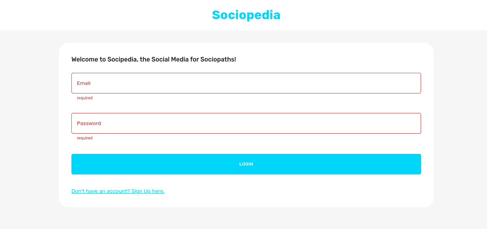
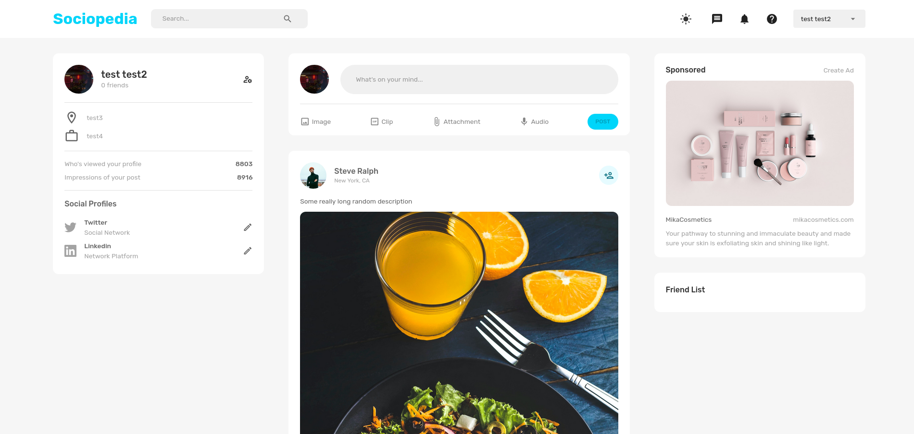
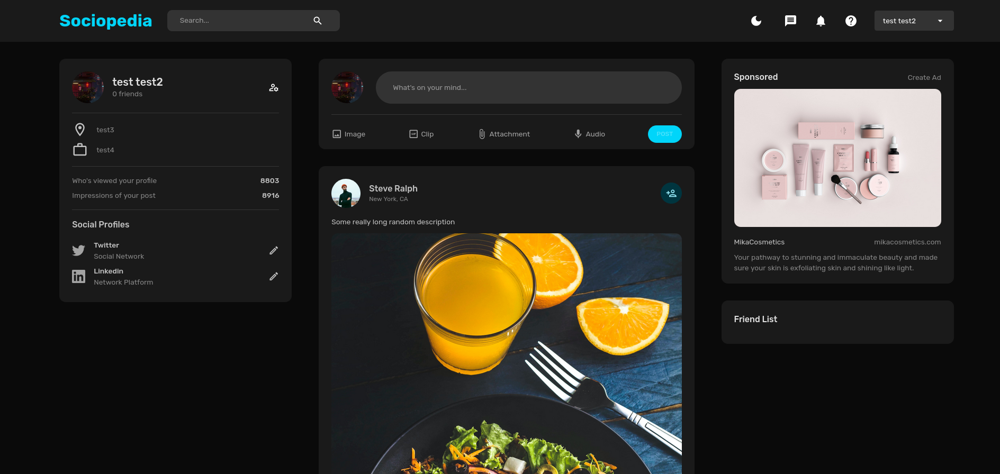
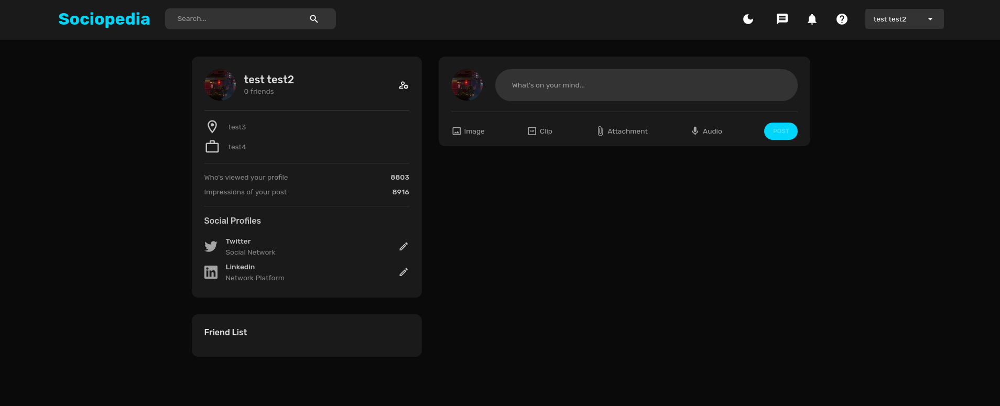

# Social Media App with React, Redux, Material UI, Express, and MongoDB
This project was just for learning purpose

:-------------------------:|:-------------------------:
        |  
:-------------------------:|:-------------------------:
       |  


## Description
This project is a robust and dynamic social media application built using the power of React, Redux, Material UI,
Express, and MongoDB. Chosen these technologies to create a standardized user interface and 
efficient state management for the application.

## Installation and Setup 
To install the application clone this git repository and install the required packages using the following commands:
```
git clone https://github.com/Emelit0/socialApp.git
cd socialApp/server
npm install
cd ../client
npm install
```
This will install all the required packages. 
>Please make sure to create a .env from the .example.env file and fill out with you own information
> and also make sure to have a MongoDB database running.

To run the application use the following command:
```
cd server
npm start
cd ../client
npm start
```
This will run the application on your local machine. 
The application should be running on (http://localhost:3000/) by default


